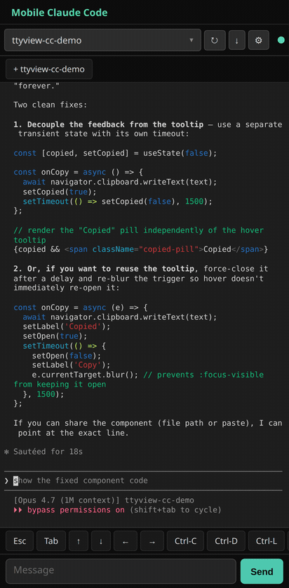

# ttyview

> Mobile-first web terminal viewer for tmux sessions. A thin **plugin platform** built around live tmux pane rendering — designed primarily for driving Claude Code (and other TUI agents) from your phone.

<p align="center">
  
</p>

## Try it

Three live demos, no install needed:

| URL | What you get |
| --- | --- |
| [Static demo](https://ttyview-demo-970754302332.us-central1.run.app/) | Bundled CC chat transcript + theme switcher + plugin installer. Cloud Run, free-tier. |
| [Spectator](https://spectator.34.132.26.75.sslip.io/) | Live read-only view of `top` running in a real tmux session on a GCE VM. Input is blocked. |
| [Sandbox](https://sandbox.34.132.26.75.sslip.io/) | Click "Start a session" → get your own ephemeral shell + tmux + plugin install. Self-destructs after 15 min idle. |


Run a daemon on your machine; it attaches read-only to your tmux sessions and exposes a structured cell-grid + live cell-diff stream over HTTP/WebSocket. Open the daemon's URL in any browser — see your live tmux session rendered.

```
[Browser]  ←HTTPS/WSS→  [ttyview]  ←tmux -C→  [your tmux + Claude Code]
```

## Why ttyview

Most "tmux on the web" projects render xterm.js + a PTY pipe. ttyview ships a structured cell grid (positions + chars + colors + per-cell mtime) and a cell-diff event stream. That gives you stable DOM, frozen scrollback, replaceable renderers, and per-row timestamps — the things that matter when the TUI inside is Claude Code (which leaks ghost UI into tmux scrollback on every redraw).

Every visible part of the UI is a **plugin** — including the cell renderer itself. You can install plugins from the bundled or remote registry, swap themes, add header widgets, add keyboard accessory rows.

## Status

**v0.1.x — public release.** Daemon attaches to all tmux sessions, serves a structured-grid + WebSocket API, and ships a plugin-based browser client. See [`CHANGELOG.md`](CHANGELOG.md) for what's in each release.

What works:

- ✅ Daemon attaches to all tmux sessions on your local server
- ✅ HTTP API: `/panes`, `/panes/:id/grid`, `/panes/:id/text`, `/panes/:id/scrollback`
- ✅ WebSocket: live `cell-diff`, `grid-reset`, `scrollback-append` events
- ✅ Send keys back to tmux: `{t:"input", p:"<pane>", keys:"..."}`
- ✅ TLS: `--tls-cert` / `--tls-key`
- ✅ **Plugin platform**: contribution points for terminal views, themes, header widgets, input accessories, settings tabs, commands
- ✅ **Discover tab**: install plugins from bundled or remote registry
- ✅ **Persisted state**: active terminal view + active theme survive reload
- ✅ **Command palette** (Ctrl/Cmd-K): fuzzy-search registered commands; dynamic switchers for active theme + terminal view
- ✅ **Bundled plugins**: Clock, Pane Counter, Quick Keys, Plain Text view, **Claude Code chat view** (renders the active pane's CC JSONL transcript), Solarized Dark / Terminal Green / Nord themes
- ✅ **`scripts/ttyview-diag`** — bash+jq summary of `--diag-log` JSONL (event counts, time range, slowest events, errors)

What's coming:

- Plugin sandbox (iframe + postMessage) — currently plugins eval into the page
- Remote `ttyview/community-plugins` repo as the default registry
- More built-in CC-on-phone features (push notifications, session reconnect, voice)
- Plugin SDK package on npm

## Install

Requires: `tmux`, a tmux session running on the same machine.

### Pre-built binary (recommended)

Each tagged release publishes Linux + macOS binaries for `x86_64` and `aarch64`.

1. Pick the asset matching your OS/arch from the [latest release](https://github.com/ttyview/ttyview/releases/latest).
2. Extract it and move `ttyview` somewhere on your `PATH`:

   ```bash
   tar -xzf ttyview-*-$(uname -m)-*.tar.gz
   install -m 0755 ttyview ~/.local/bin/
   ```

3. Start the daemon: `ttyview --bind 127.0.0.1:7681` and open the URL in your browser.

A one-line installer (`curl … | sh`) is coming in v0.2.

### From source

Requires the Rust toolchain.

```bash
git clone https://github.com/ttyview/ttyview
cd ttyview
cargo build --release
./target/release/ttyview --bind 127.0.0.1:7681
```

### Phone access

Expose the port via Tailscale serve or any HTTPS reverse proxy. Or pass TLS cert/key directly:

```bash
ttyview \
  --bind 0.0.0.0:7681 \
  --tls-cert ~/.config/ttyview/tls.crt \
  --tls-key  ~/.config/ttyview/tls.key
```

## CLI options

```
ttyview [OPTIONS]

  --bind <ADDR>          Address to bind.                       [default: 127.0.0.1:7681]
  --socket <NAME>        tmux socket (-L). Default: server's default.
  --rows <N>             Default pane rows.                     [default: 50]
  --cols <N>             Default pane cols.                     [default: 80]
  --tls-cert <PATH>      PEM cert; pair with --tls-key for HTTPS.
  --tls-key  <PATH>      PEM key.
  --diag-log <PATH>      JSONL file for client telemetry events. Default: dropped.
  --registry-url <URL>   Remote plugin registry. Default: bundled-only.
```

## Plugins

Installed plugins live at `~/.config/ttyview/plugins/`. The Settings overlay (⚙ in the header) has a **Discover** tab listing what's available — tap **Install** and the plugin's source is downloaded, persisted, and `eval()`'d into the page right away. They reload automatically on every page load.

A plugin is just a JS file that calls `window.ttyview.contributes.<kind>({...})`. The full contract:

```js
window.ttyview.contributes.headerWidget({
  id: 'my-clock',
  name: 'My Clock',
  render: function(slot) {
    const span = document.createElement('span');
    slot.appendChild(span);
    const id = setInterval(() => { span.textContent = new Date().toLocaleTimeString(); }, 1000);
    return () => clearInterval(id);   // unmount fn
  },
});
```

Contribution kinds (v1):

- `terminalView` — full-screen pane renderer (cell-grid is the default)
- `theme` — overrides 7 CSS custom properties on `:root`
- `headerWidget` — span in the top header
- `inputAccessory` — button row above the chat input (good for mobile soft-keyboard hotkeys)
- `settingsTab` — adds a tab to the Settings overlay
- `command` — registers a name + handler (palette UI coming)

See [CONTRIBUTING.md](CONTRIBUTING.md) for the full plugin spec.

## Layout

```
ttyview/
├── Cargo.toml                          # workspace root
├── crates/
│   ├── ttyview-core/
│   │   ├── src/
│   │   │   ├── grid/                   # Cell, Line, Cursor, Screen
│   │   │   ├── parser/                 # vte::Perform → Screen mutations
│   │   │   ├── source/                 # tmux -C control-mode source
│   │   │   ├── state/                  # pane store + broadcasters
│   │   │   ├── api/                    # HTTP, WebSocket, plugin endpoints
│   │   │   ├── detectors/              # claude / shell heuristics
│   │   │   └── cli/                    # daemon entry-point
│   │   ├── ui/index.html               # bundled web client + plugin platform
│   │   └── community-plugins/          # bundled plugins + registry.json
│   └── ttyview-daemon/                 # thin CLI wrapping ttyview-core (binary: `ttyview`)
├── client/                             # @ttyview/client npm package (stub)
├── tests/
│   ├── client/                         # vitest (35 cases) for the bundled client
│   └── e2e/                            # Playwright end-to-end (TBD harness)
└── docs/
```

## Acknowledgements

`crates/ttyview-core` is extracted from [eyalev/panel](https://github.com/eyalev/panel), an earlier experiment. Mobile UX patterns derive from [eyalev/tmux-web](https://github.com/eyalev/tmux-web).

## License

MIT.
